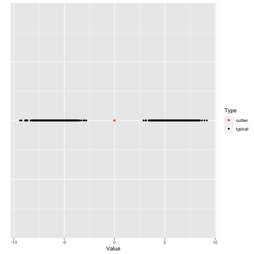
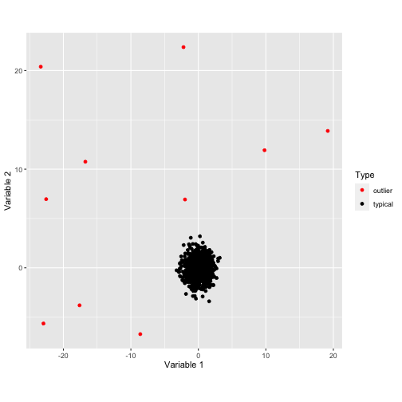
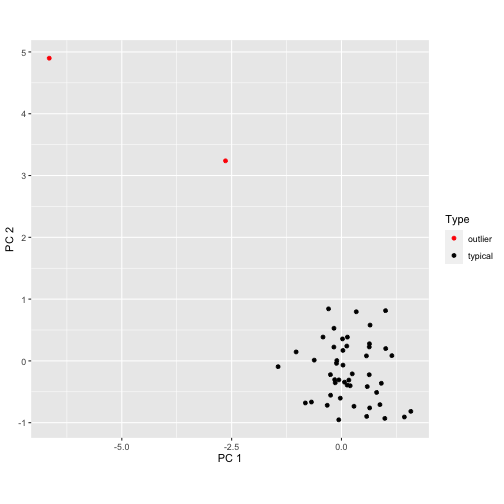
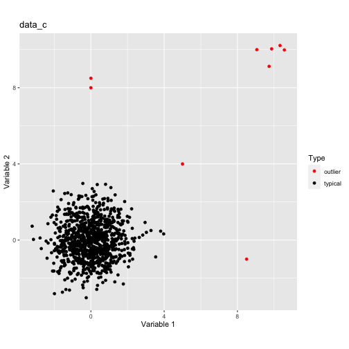
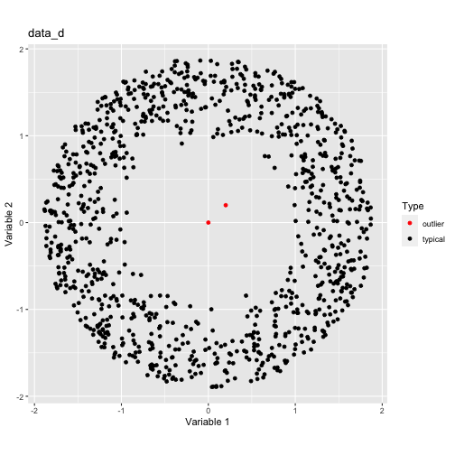

<!-- README.md is generated from README.Rmd. Please edit that file -->

<!-- rmarkdown v1 -->


# stray {STReam AnomalY} 

[](https://www.repostatus.org/#wip)
[](https://www.gnu.org/licenses/old-licenses/gpl-2.0.html)

[](https://travis-ci.org/pridiltal/stray)
 
---
 
[](https://cran.r-project.org/)
[](https://cran.r-project.org/package=stray)
[](commits/master)
 
---
 
[](/commits/master)


<!-- README.md is generated from README.Rmd. Please edit that file -->


Anomaly Detection in High Dimensional Data Space

This package is a modification of [HDoutliers package](https://CRAN.R-project.org/package=HDoutliers). The HDoutliers algorithm is a powerful unsupervised algorithm for detecting anomalies in high-dimensional data, with a strong theoretical foundation. However, it suffers from some
limitations that significantly hinder its performance level, under certain circumstances. In this package, we propose an algorithm that addresses these limitations. We define an anomaly as an
observation that deviates markedly from the majority with a large distance gap. An approach based on extreme value theory is used for the anomalous threshold calculation. 


A companion paper to this work is available [here](https://arxiv.org/pdf/1908.04000.pdf). Using various
synthetic and real datasets, we demonstrate the wide applicability and usefulness of our algorithm, which we call the stray algorithm. We also demonstrate how this algorithm can
assist in detecting anomalies present in other data structures using feature engineering. We show the situations where the stray algorithm outperforms the HDoutliers algorithm both in
accuracy and computational time. 


This package is still under development and this repository contains a development version of the R package *stray*.

## Installation

You can install the released version of stray from [CRAN](https://CRAN.R-project.org) with:

```r
install.packages('stray', dependencies = TRUE)
```

You can install stray from github with:

```r
# install.packages("devtools")
devtools::install_github("pridiltal/stray")
```

## Example

### One dimensional data set with one outlier

```r
library(stray)
require(ggplot2)
#> Loading required package: ggplot2
set.seed(1234)
data <- c(rnorm(1000, mean = -6), 0, rnorm(1000, mean = 6))
outliers <- find_HDoutliers(data, knnsearchtype = "brute")
names(outliers)
#> [1] "outliers"   "out_scores" "type"
display_HDoutliers(data, outliers)
```



### Two dimensional dataset with 8 outliers

```r
set.seed(1234)
n <- 1000 # number of observations
nout <- 10 # number of outliers
typical_data <- matrix(rnorm(2*n), ncol = 2, byrow = TRUE)
out <- matrix(5*runif(2*nout,min=-5,max=5), ncol = 2, byrow = TRUE)
data <- rbind(out, typical_data )
outliers <- find_HDoutliers(data, knnsearchtype = "brute")
display_HDoutliers(data, outliers)
```



### Three dimensional dataset with 2 outliers

For data with more than two dimensions, two dimensional scatterplot is produced using the first two pricipal components.


```r
data <- rbind(matrix(rnorm(144), ncol = 3), c(10,12,10),c(3,7,10))
output <- find_HDoutliers(data, knnsearchtype = "brute")
display_HDoutliers(data, out = output)
```


gitn

More examples are available from our paper [Anomaly Detection in High Dimensional Data](https://www.monash.edu/business/ebs/research/publications/ebs/wp20-2019.pdf) 


```r
outliers<-find_HDoutliers(data_c[,1:2], knnsearchtype= "brute")
p <- display_HDoutliers(data_c[,1:2], outliers)+
      ggplot2::ggtitle("data_c")

print(p)
```




```r
outliers<-find_HDoutliers(data_d[,1:2], knnsearchtype= "brute")
p <- display_HDoutliers(data_d[,1:2], outliers)+
      ggplot2::ggtitle("data_d")

print(p)
```



